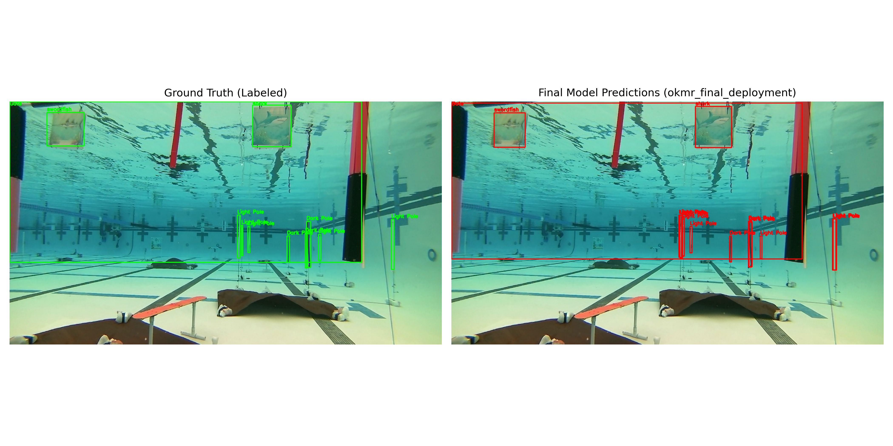
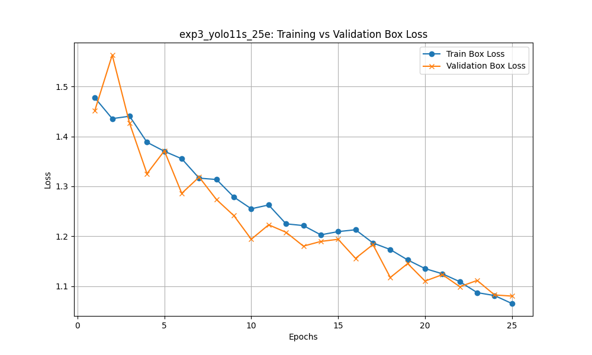
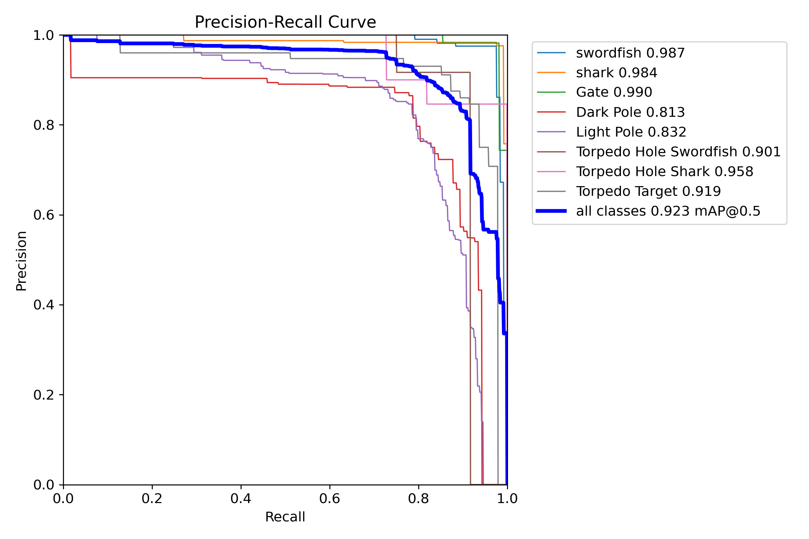

<div align="center">
  <h1>Deep Learning-Based Underwater Object Detection for AUVs</h1>
  <p><strong>CMPE 401: Deep Learning for Engineers (Self-Defined Final Project)</strong></p>
  <p><strong>Author:</strong> David Manhart</p>

  
  
  
  
</div>

<br>

<div align="center">
  
  <p><em>Figure 1: Ground Truth (Left) vs. YOLO11s ONNX Predictions (Right). The model successfully handles severe subsea visual degradation.</em></p>
</div>

---

## Project Objective
This repository contains an end-to-end, deep learning-based computer vision pipeline engineered specifically for **Autonomous Underwater Vehicles (AUVs)**. Operating in subsea environments introduces severe visual degradation—including light attenuation, non-linear color distortion, and high turbidity—which render traditional heuristic computer vision techniques obsolete.

The primary objective is to demonstrate real-world morphological detection: classifying marine life and subsea infrastructure by structural features. This includes distinguishing between highly similar biological targets (e.g., `swordfish` vs `shark`) and identifying navigation markers (e.g., `Gate`). This pipeline bridges the gap between deep learning theory and the strict hardware-constrained realities of edge computing, inspired directly by the competitive tasks undertaken by the **UBC Okanagan Marine Robotics Club (OKMR)**.

## Evolution from the Instructor-Defined Project
This work originated from the CMPE 401 Instructor-Defined Project (IDP), which focused on detecting urban objects from aerial drones using the VisDrone dataset. While the IDP provided a strong foundation in deep learning workflows, this Self-Defined Project pivots to address the challenges of domain adaptation, data sparsity, and strict latency requirements. The repository has been streamlined into an empirical pipeline optimized for deployment on low-power AUV hardware (e.g., NVIDIA Jetson Nano).

---

## Key Findings and Results

Through a rigorous iterative experimentation strategy evaluating network capacity (YOLO11n vs YOLO11s) against input tensor resolution (640px vs 320px), the optimal model architecture was determined to be **YOLO11s at 640px resolution**.

### Final Deployment Metrics:
- **Accuracy:** `0.926 mAP50` (Vastly exceeding the >0.85 project requirement).
- **Speed:** `286.2 FPS` via ONNX graph optimization (Exceeding the >30 FPS real-time edge requirement).

<div align="center">
  
  
  <p><em>Figure 2: (Left) Stable Training/Validation Loss Convergence over 25 epochs. (Right) Precision-Recall curve demonstrating high precision across all 8 subsea classes.</em></p>
</div>

---

## Repository Structure
```text
CMPE401_IDP1_V2_DM/
├── data/                       # Configuration (dataset.yaml) & scripts for unpacking data
├── src/
│   ├── config.py               # Centralized parameters and hardware allocation
│   ├── train.py                # Core PyTorch training loop
│   ├── run_experiments.py      # Automated suite that trains 4 distinct models for validation
│   ├── evaluate.py             # Metric extraction tool
│   ├── inference.py            # Script for testing the model on raw underwater footage
│   ├── visualize_comparison.py # Generates Ground Truth vs Prediction plots
│   └── final_pipeline.py       # Master script: Trains, validates criteria, and exports to ONNX
├── report/                     # Contains the comprehensive IEEEtran Academic Report (.tex & .pdf)
├── overleaf_export/            # Flat folder containing the report and all graphics for Overleaf
└── results/                    # Generated loss curves, weights (.pt / .onnx), and metrics
```

---

## Setup and Reproduction

### 1. Environment
Ensure you have a CUDA-capable GPU (though CPU fallback is supported) and are utilizing a Python virtual environment.
```bash
pip install -r requirements.txt
```

### 2. Dataset Preparation
The project expects YOLO-formatted data. If you have the raw zip archives (e.g., `Gate Task.zip` and `front.zip`), place them in the root directory and run:
```bash
python data/setup_data.py
```
This automatically extracts, structures, and normalizes the class indices into `data/`.

### 3. Running the Empirical Experiments
Deep learning requires empirical proof. You can reproduce the exact learning process documented in the Final Report by kicking off the automated experimental suite. This runs a Baseline (Nano), a Capacity Check (Small), a Convergence Run, and an Edge Optimization (320px) run.
```bash
python src/run_experiments.py
```

### 4. Visual Comparison and Inference
To visually verify the model's accuracy, you can generate a side-by-side comparison of human-annotated Ground Truth boxes versus the YOLO Predictions:
```bash
python src/visualize_comparison.py
```
To run inference on the raw test images:
```bash
python src/inference.py
```

### 5. The Final Deployment Pipeline
Once the optimal parameters were determined from the experiments, they were hardcoded into the final deployment script. This script automatically trains the definitive model, verifies it against the OKMR engineering success criteria, and exports the `.onnx` artifact for the AUV team to physically deploy:
```bash
python src/final_pipeline.py
```
Everything required for physical hardware deployment is neatly packaged into `results/okmr_final_deployment/`.
